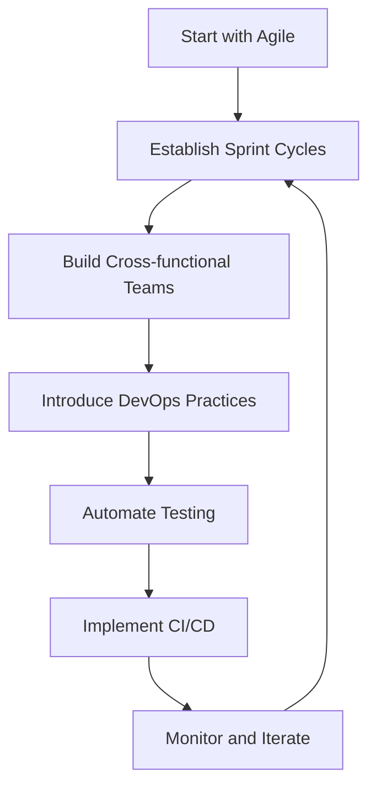

# Agile vs DevOps: Understanding the Differences

While Agile and DevOps are often mentioned together, they serve different purposes in software development and organizational culture. Understanding their relationship helps teams implement both effectively.

## What is DevOps?

DevOps is a set of practices that combines software development (Dev) and IT operations (Ops) to shorten the development lifecycle and provide continuous delivery with high software quality.

## Key Differences

| Aspect | Agile | DevOps |
|--------|-------|--------|
| **Focus** | Software development methodology | Software development and operational practices |
| **Scope** | Development team | Entire organization (Dev + Ops) |
| **Goal** | Deliver working software frequently | Continuous integration and deployment |
| **Timeline** | 2-4 week sprints | Continuous activities (CI/CD, monitoring, feedback) |
| **Communication** | Within development team | Cross-functional collaboration |

!!! info "What 'Continuous' Means in DevOps"
    DevOps "continuous process" refers to ongoing activities that happen constantly:
    
    - **Continuous Integration (CI)**: Code is merged and tested multiple times per day
    - **Continuous Deployment (CD)**: Code changes are automatically deployed to production
    - **Continuous Monitoring**: Systems are monitored 24/7 for performance and issues
    - **Continuous Feedback**: User feedback and metrics are collected in real-time
    
    Unlike Agile's sprint cycles, these DevOps practices don't pause between iterations - they run continuously throughout development and after deployment.

## The Cultural Component

When we say DevOps emphasizes "culture," we mean:

- **Shared responsibility** - Developers and operations teams share ownership of the entire software lifecycle
- **Collaboration mindset** - Breaking down traditional silos between teams
- **Continuous learning** - Embracing failure as learning opportunities
- **Automation first** - Cultural shift toward automating repetitive tasks
- **Customer focus** - Both Dev and Ops align around delivering value to end users

This cultural transformation is what makes DevOps more than just a set of tools - it's a fundamental change in how teams work together.

## Similarities

Both Agile and DevOps emphasize:

- **Collaboration** over silos
- **Iterative improvement** 
- **Customer feedback** and responsiveness
- **Automation** where possible
- **Quality** as a shared responsibility

## How They Work Together

!!! success "Complementary Approaches"
    Agile and DevOps are not competing methodologies - they complement each other perfectly.

### Agile Enables DevOps
- Short iterations align with continuous delivery
- Cross-functional teams support DevOps culture
- Regular retrospectives drive operational improvements

### DevOps Enhances Agile
- Automated testing speeds up sprint cycles
- Continuous deployment reduces release friction
- Infrastructure as code supports rapid scaling

## Implementation Strategy

## Common Misconceptions

!!! warning "Myth vs Reality"
    **Myth**: DevOps replaces Agile  
    **Reality**: DevOps extends Agile principles to operations

    **Myth**: You must choose one or the other  
    **Reality**: They work best when implemented together

## Best Practices for Integration

1. **Start with Agile fundamentals**
   - Establish sprint cycles
   - Build collaborative culture
   - Focus on working software

2. **Gradually introduce DevOps**
   - Automate manual processes
   - Implement continuous integration
   - Break down Dev/Ops silos

3. **Measure and improve**
   - Track deployment frequency
   - Monitor mean time to recovery
   - Gather feedback continuously

## Conclusion

Agile and DevOps are complementary approaches that, when combined, create a powerful framework for delivering high-quality software rapidly and reliably. Organizations benefit most when they implement both as part of a cohesive strategy.
