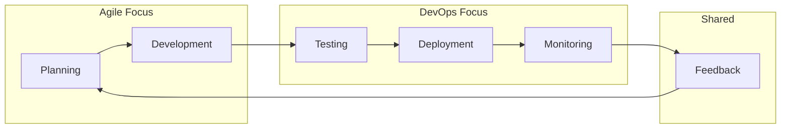

# Introduction to Modern Software Development

Welcome to the fundamentals of modern software development! This guide explores how **Agile methodology** and **DevOps practices** work together to create efficient, collaborative, and responsive development environments.

## The Evolution of Software Development

Traditional software development often involved long planning phases, extensive documentation, and infrequent releases. Modern approaches emphasize:

- **Iterative development** over waterfall planning
- **Collaboration** over siloed teams
- **Continuous delivery** over infrequent releases
- **Rapid feedback** over delayed validation

## Two Complementary Approaches

### Agile Methodology
Focuses on **how teams work together** to build software:
- Iterative development in short cycles (sprints)
- Cross-functional team collaboration
- Customer feedback and adaptation
- Working software as the measure of progress

### DevOps Practices
Focuses on **how software moves from development to production**:
- Continuous integration and deployment
- Infrastructure automation
- Monitoring and feedback loops
- Collaboration between development and operations

## The Modern Development Lifecycle

## Benefits of Integration

When Agile and DevOps work together, teams achieve:

- **Faster delivery** of valuable features
- **Higher quality** through continuous testing and monitoring
- **Better collaboration** across all teams
- **Increased reliability** and reduced downtime
- **Rapid response** to customer needs and market changes

## Getting Started

!!! tip "Learning Path"
    We recommend following this learning sequence:
    
    1. **Start with Agile**: Learn the [core principles](principles.md) and mindset
    2. **Understand frameworks**: Explore [Scrum](scrum.md) or other methodologies
    3. **Add DevOps**: See how [Agile and DevOps complement each other](agile-vs-devops.md)
    4. **Practice**: Apply [specific practices](../practices/sprint-planning.md) in your team

## What Makes This Approach Different?

Modern software development breaks down traditional barriers:

| Traditional Approach | Modern Approach |
|---------------------|-----------------|
| Long planning cycles | Short, iterative cycles |
| Separate Dev/Ops teams | Collaborative, cross-functional teams |
| Infrequent releases | Continuous delivery |
| Documentation-heavy | Working software focus |
| Change resistance | Change embracement |

!!! info "Next Steps"
    Dive deeper into [Agile Principles](principles.md) to understand the foundation, or explore how [Agile compares to DevOps](agile-vs-devops.md).
