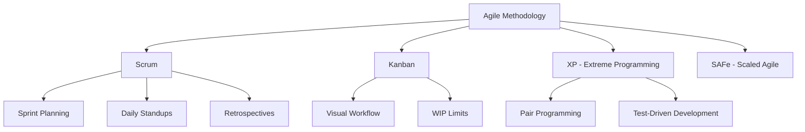

# Agile Principles

Agile methodology transforms how teams approach software development and project management by emphasizing iterative progress, collaboration, and adaptability.

## The Agile Manifesto

The Agile Manifesto defines four core values that guide agile development:

1. **Individuals and interactions** over processes and tools
2. **Working software** over comprehensive documentation
3. **Customer collaboration** over contract negotiation
4. **Responding to change** over following a plan

!!! note "Understanding the Values"
    These values don't dismiss the importance of processes, documentation, contracts, or plans. Instead, they emphasize that the items on the left are more valuable for successful software development.

## The 12 Agile Principles

Beyond the four values, the Agile Manifesto outlines 12 principles:

1. **Customer satisfaction** through early and continuous delivery of valuable software
2. **Welcome changing requirements**, even late in development
3. **Deliver working software frequently**, with a preference for shorter timescales
4. **Business people and developers** must work together daily
5. **Build projects around motivated individuals** and trust them to get the job done
6. **Face-to-face conversation** is the most efficient method of communication
7. **Working software** is the primary measure of progress
8. **Sustainable development** pace that teams can maintain indefinitely
9. **Technical excellence** and good design enhance agility
10. **Simplicity** - maximizing the amount of work not done
11. **Self-organizing teams** produce the best architectures and designs
12. **Regular reflection** and adjustment of team behavior

## Benefits of Agile Principles

- **Faster time to market** through iterative delivery
- **Improved customer satisfaction** via continuous collaboration
- **Better team collaboration** and communication
- **Increased adaptability** to changing requirements
- **Higher quality deliverables** through continuous improvement
- **Reduced risk** through early and frequent feedback

## Common Agile Frameworks

!!! tip "Choosing a Framework"
    Different frameworks work better for different teams and projects:
    
    - **Scrum**: Great for teams new to agile, provides structure
    - **Kanban**: Ideal for teams with continuous flow of work
    - **XP**: Best for teams focused on technical excellence
    - **SAFe**: Suitable for large organizations with multiple teams

## Implementing Agile Principles

### Start Small
Begin with one or two principles and gradually adopt more as your team becomes comfortable with the agile mindset.

### Focus on Culture
Agile is more about mindset and culture than specific practices. Emphasize collaboration, communication, and continuous learning.

### Measure and Adapt
Use metrics like velocity, cycle time, and customer satisfaction to understand your progress and make improvements.

!!! info "Next Steps"
    Learn about specific frameworks starting with [Scrum Framework](scrum.md) or explore how [Agile and DevOps work together](agile-vs-devops.md).
