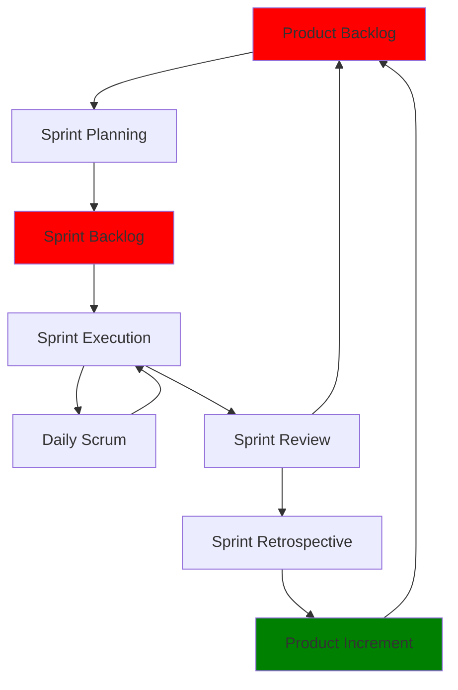

# The Scrum Framework: A Complete Guide

Scrum is the most widely adopted Agile framework for managing product development. It provides a structured yet flexible approach to delivering valuable software through iterative development and continuous improvement.

## What is Scrum?

Scrum is a lightweight framework that helps teams work together to develop, deliver, and sustain complex products. It's built on empirical process control theory, emphasizing transparency, inspection, and adaptation.

## Core Principles

Scrum is founded on three pillars:

- **Transparency** - All aspects of the process (work, progress, goals, and challenges) are visible to those responsible  for the outcome
- **Inspection** - Scrum artifacts(Product Backlog, Sprint Backlog, Increment/Done) and progress are frequently inspected to detect variances
- **Adaptation** - Adjustments are made when deviations are detected

## The Scrum Team

### Product Owner
- Manages the Product Backlog
- Defines acceptance criteria and priorities
- Acts as the voice of the customer

### Scrum Master
- Facilitates Scrum events
- Removes impediments/obstacles for the team
- Coaches the team on Scrum practices

### Development Team
- Develops the product increment
- Self-organizes to complete work
- Typically 3-9 cross-functional members

## Scrum Events (Ceremonies)

### Sprint
!!! info "Sprint Overview"
    A time-boxed iteration (usually 1-4 weeks) during which a potentially shippable product increment is created.

### Sprint Planning
**Purpose:** Plan the work for the upcoming sprint  
**Duration:** Up to 8 hours for a 4-week sprint  

**Key questions:**
1. What can be delivered in this sprint?
2. How will the work be accomplished?

### Daily Scrum
**Purpose:** Synchronize team activities  
**Duration:** 15 minutes  

**Three questions:**
1. What did I do yesterday?
2. What will I do today?
3. Are there any impediments?

### Sprint Review
**Purpose:** To present the completed product increment to stakeholders  
**Focus:** Gather constructive feedback, and inform future backlog adjustments.  
**Participants:** Scrum Team + Stakeholders

### Sprint Retrospective
**Purpose:** Inspect the team's process and plan improvements  
**Focus:** What went well, what could improve, what to commit to  
**Participants:** Scrum Team (Product Owner, Scrum Master, Development Team)

## Scrum Artifacts

### Product Backlog
Ordered list of features and requirements for the product, prioritized by business value.

**Example user story format:**
```
As a [user type], I want [goal] so that [benefit]

Acceptance Criteria:
- Given [context], when [action], then [outcome]
```

### Sprint Backlog
Product Backlog items selected for the sprint plus the plan for delivering them.

### Product Increment
Sum of all completed items that meet the Definition of Done.

## Definition of Done (DoD)

A shared understanding of completion criteria:

- [ ] Code is written and reviewed
- [ ] Tests are written and passing
- [ ] Documentation is updated
- [ ] Product Owner has accepted the work

## Estimation and Metrics

### Story Points
Relative sizing using Fibonacci sequence (1, 2, 3, 5, 8, 13, 21) focusing on complexity rather than time.

### Velocity
Amount of work completed in a sprint, used for planning future sprints.

### Burndown Charts
Visual representation of remaining work in a sprint or release.

## Best Practices

### Getting Started
1. Form the team with proper roles
2. Create initial Product Backlog
3. Establish Definition of Done
4. Plan and execute first sprint

### Common Anti-Patterns to Avoid

!!! warning "Scrum Anti-Patterns"
    **Scrum-but**: Skipping key ceremonies or practices  
    **Mini-waterfall**: Treating sprints as sequential phases  
    **Proxy Product Owner**: Decision-making by non-PO  

## Continuous Improvement

### Retrospective Techniques
- **Start, Stop, Continue** - Simple improvement format
- **5 Whys** - Root cause analysis of a problem
- Focus on actionable improvements each sprint

## Scrum Process Flow



## Conclusion

Scrum provides a proven framework for teams to deliver value incrementally while continuously improving. Success requires commitment to its principles, consistent practice, and willingness to adapt based on experience and feedback.
